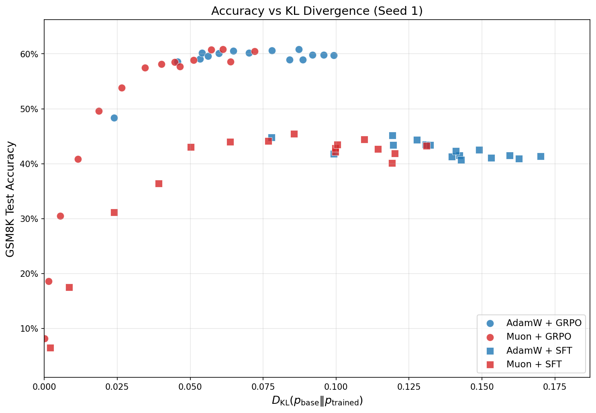
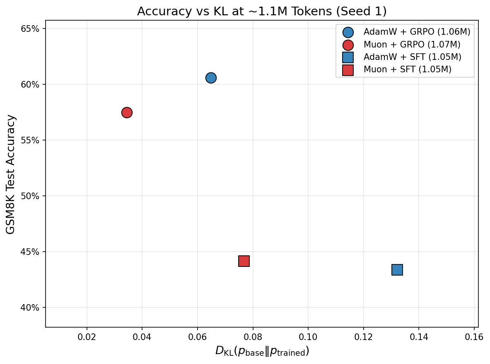
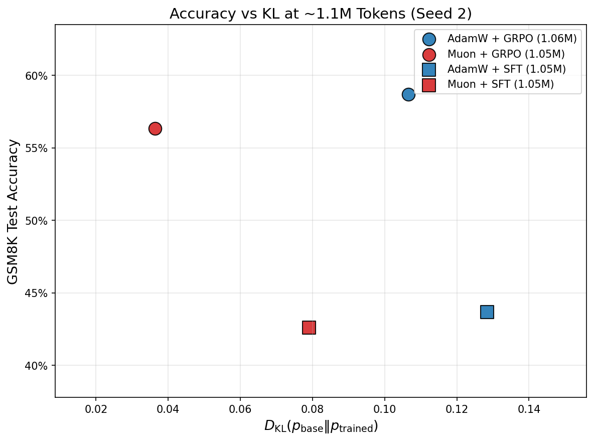
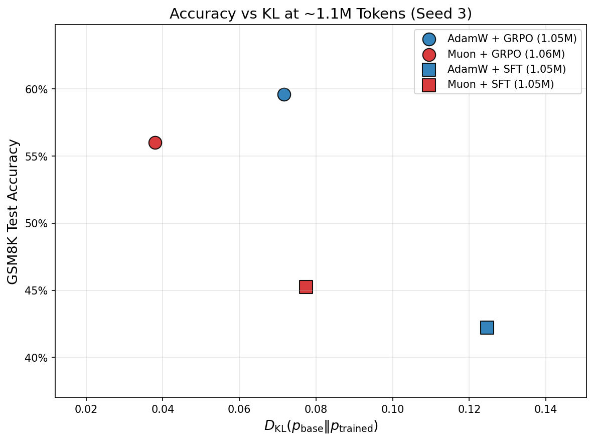

# Analyzing the KL-drift of Muon vs. GRPO


## Background

Muon is a recent optimizer developed by Jeremy Bernstein, Keller Jordan, Laker Newhouse, and a few others which works by optimizing 
dense 2D matrices under a spectral norm constraint. 

It has been studied extensively in pretraining contexts but limited studies have investigated its apllicability in post-training settings.

Muon essentially accelerates neural network convergence by enforcing a constraint on the **spectral norm** of the weight update matrix $\Delta W$, essentially limiting the scaling of the principal direction of the update step to be no more than the learning rate. Since we seek the largest $\Delta W$, the natural result ends up being the matrix $\Delta W$ which has its singular value spectrum all set to the sign function (sent to 1) and scaled by the learning rate. The result is that $\Delta W$ is now a dense, isotropic matrix encoding purely rotational information, allowing the optimizer to take a step of exactly size $\eta$ in the optimal direction. 

This helps optimization because it allows the optimizer to more effecively represent tail-end features, preventing covariance shift. 
The implication however is that Muon always produces **dense** updates. 

Reinforcement Learning algorithms on the other hand are known for producing **sparse** model updates during the optimization process. There are many studies which claim the reason for RL's superior generalization and ability to retain performance on past tasks is inherently due to the updates being sparse in RL versus the dense updates made in SFT. 

An alternative explanation however for the discrepancy between SFT and RL in continual learning settings is that SFT shifts the model further from the base policy, resulting in a greater reverse KL $D_{\text{KL}}(\pi_0 || \pi)$ whereas RL samples from the base policy and instead makes smaller, targetted adjustments in its sampling policy as it trains, allowing it to reach the same quality or better solution quality while retaining a minimal KL shift compared to SFT.


Assuming that our assumption about the source of RL's generalization coming from sparse updates is true, Muon cannot suitably optimize a policy in RL without greatly degarding its abilities on other tasks in comparison to the standard optimizer AdamW. 

### Goal of study


We want to answer the question: does RL generalize well becuase it produces sparse updates compared to SFT? Or can we come up with a **dense** $\Delta W$ which performs the same or better than the current best-known bounds. 

## Experimental setup 

To answer this question, we take a `qwen2-1.5b-instruct` model and train it to produce correctly-formaatted and mathematically accurate responses to questions from the GSM8K dataset.
We train the model in GRPO settings with Muon and AdamW using well-known settings, and compare them to an SFT baseline.

### Data format

The model is given questions from the GSM8K dataset and asked to produce the correct answer inside of answer tags like: `<answer>...</answer>`.

For example, the following prompt may be given to the model:

```
<system>
You are a helpful math assistant. Always provide your final numerical answer inside of the <answer>...</answer> tags, e.g.: <answer>42</answer>
<user>
What is 9 + 10?
```

And the model should be able to produce an answer like:

```
<assistant>
Hmm 9 + 10 = 21 so the answer is 21
<answer>21</answer>
```

### Training Details

To train the model, we take the `train` split of OpenAI's GSM8K dataset from HuggingFace hub and produce an 80/20 train/validation split.
We train both optimizers in GRPO and SFT in order to have an accurate baseline.

We fix all hyperparameters of training, and fix the batch size such that the effective batch size (number of rollouts being processed in a single optimizer step) are equivalent across both algorithms, opting for a batch size of 64.
We also count the number of tokens that we actually compute loss and backprop on, using this as the budget for training. In the case of SFT, this is simply equivalent to all of the tokens unmasked in the assistant message, whereas GRPO uses the token IDs produced during inference. 

Both algorithms use mixed precision training with bfloat16 forward/backward passes with flash-attention. 

A learning rate of $\eta = 1 \times 10^{-6}$  is used for all experiments + optimizers uniformly. No scheduler is used, so the learning rate remains constant throughout the entire process.

#### GRPO

For these training runs, we use Vanilla GRPO as proposed by DeepSeek-Math (https://arxiv.org/abs/2402.03300). 

For each iteration of the GRPO algorithm, we sample $B = 8$ batches to produce a group of $G = 8$ rollouts, creating a total batch size of $B \times G = 64$.
The rollouts are sampled with a temperature of 0.7, 512 max new tokens, and the same system prompt as we evaluate the model on. 

Once the rollouts have been produced, we perform an inner GRPO loop using a batch size of 64 and 2 epochs -- effectively producing 2 optimizer steps on the sampled rollouts.

An individual rollout receives a format reward of $r_F = 0.1$  when it correctly produces a numerically-parsable answer inside of  `<answer>...</answer>` tags. When the answer is correct, it receives an accuracy reward of $r_A = 1.0$, for a maximum reward of $r = r_F + r_A = 1.1$. 


Additionally, we do **NOT** apply a KL penalty in this scenario, so our loss function is effectively: 

$$
\begin{align*}
J(\theta) &= \mathcal{L}_\text{GRPO} (\pi_\theta)  \\
J(\theta) &=  \argmax_\theta \frac{1}{N} \sum_{i=1}^{N} \frac{1}{|O_i|} \sum_{j=1}^{|O_i|} \mathcal{L_\text{CLIP}(\pi_\theta, O_{i,j})} - \beta \cdot \mathcal{L}_\text{KL}(\pi_\theta, \pi_\text{ref}, O_{i,j})   \\
J(\theta) &=  \argmax_\theta \frac{1}{N} \sum_{i=1}^{N} \frac{1}{|O_i|} \sum_{j=1}^{|O_i|} \mathcal{L_\text{CLIP}(\pi_\theta, O_{i,j})} - 0 \cdot \mathcal{L}_\text{KL}(\pi_\theta, \pi_\text{ref}, O_{i,j})   \\
J(\theta) &=  \argmax_\theta \frac{1}{N} \sum_{i=1}^{N} \frac{1}{|O_i|} \sum_{j=1}^{|O_i|} \mathcal{L_\text{CLIP}(\pi_\theta, O_{i,j})} \\
J(\theta) &=  \argmax_\theta \frac{1}{N} \sum_{i=1}^{N} \frac{1}{|O_i|} \sum_{j=1}^{|O_i|} \min(\rho_{i,j} \cdot \hat{A}_{i}, \, \text{clip}(\rho_{i,j} , 1 - \epsilon, 1 + \epsilon)  \cdot \hat{A}_{i} )      \\
\end{align*}
$$

#### SFT

We compare GRPO against an SFT baseline, where our target objective is just standard cross-entropy on the unmasked tokens.


#### Muon

For simplicity, we leverage the `muon_fsdp2` implementation found here: https://github.com/samsja/muon_fsdp_2 . 

We enable AdamW update RMS matching and use the follonwing hyperparams:

- lr $\eta = 1\times10^{-6}$
- momentum $\mu = 0.95$
- weight decay $\lambda = 0$ 

AdamW is applied to all 1D/vector parameters where Muon cannot be applied, with the same settings as the AdamW experiments

#### AdamW


Well-known post-training hyperparameters for AdamW are used in these experiments:

- $\beta_1 = 0.9$
- $\beta_2 = 0.95$
- $\lambda = 0$


### Evaluation 

Since our goal is to evaluate the **quality** of solution achieved and the amount of model drift required to get there, we explore the following properties:

- **Accuracy vs. Model Drift**: KL divergence from the base model and the experiment model: $D_{\text{KL}}(\pi_0 || \pi_{\text{experiment}})$, compared against accuracy on the GSM8K test set
- **Update sparsity**: Spectrum of the resulting $\Delta W = W_\text{experiment} - W_0$  

#### Checkpoint selection

During training, we counted the number of tokens that were backpropped on and trained until hitting a token budget of ~1.2m. 
To perform a fair analysis of the update sparsity, we take checkpoints from all four experiments which have been trained with a similar number of tokens and also achieve a good accuracy on the GSM8K validation set. 
In the first experiment, this corresponded to checkpoints saved at around ~1.1m tokens backpropped, near the end of training.

Then in follow-up experiments to validate our results, we simply evaluate all resulting checkpoints on the test set to understand the accuracy/KL tradeoff.


#### GSM8K Accuracy vs. KL Drift


We use the official `test` split of the gsm8k dataset provided by OpenAI and evaluate each checkpoint in the intended settings as inference (temperature 0.7 + system prompt + formatting).

To compute the KL divergence, the base model generates a single rollout for each equation in the test dataset and we then compute the logprobs of these rollouts for the base and experiment models $\pi_0, \pi_\text{exp}$,
and computing $D_{KL}(\pi_0 || \pi_\text{exp})$. 

This measurement is based on the findings of [Shenfeld, et al., 2025](https://arxiv.org/abs/2509.04259) which demonstrates that the reverse KL is strongly correlated with the amount of catastrophic forgetting that the model experiences. So if Muon's dense updates lead to stronger catastrophic forgetting, then a higher reverse KL should be a strong indicator. 

#### Update Spectrum of $\Delta W$

Since existing studies on the subject claim that RL's strength in continual learning comes from its sparse updates, we should expect to see that either Muon also yields a sparse update or that it produces worse results/higher reverse KL.

To understand the sparsity that arises from each experimental setup, we load all 5 models and compute the quantity $W_\text{exp} - W_0$ across all matching parameters.
The result should be the exact $\Delta W$ that was formed as a result of the optimization process. 

We measure sparsity by analyzing the spectral distribution of each experiment's $\Delta W$ and finding the rank at which **90% of its spectral energy** is concentrated at, and what the magnitude of the concentration is.

We define spectral concentration as:

$$
1\leq K \leq r \;\; \text{s.t.} \; \frac{\sum_{i=1}^K \sigma_i^2}{\sum_{j=1}^r \sigma_j^2}
$$

Where $r$ is the **rank** of $\Delta W$ 


### Results


#### GSM8K Accuracy / KL

**Training set performance**

When evaled directly on the training data, we see that GRPO + Muon achieves roughly the same score as AdamW (89% vs 90%) while having almost a third of the KL divergence (~0.02 vs ~0.05). 

SFT has a similar story, although there they face a much loewr score with higher KL altogether. 


**Test set performance**

After taking the best checkpoints and evaluating them on the test dataset, we see that Muon + GRPO is able to yield 60% on GSM8K with our expected format while only having a reverse KL of ~0.14, whereas AdamW yields a roughly ~0.38 reverse KL to also achieve ~60% accuracy. SFT achieves lower across the board with Muon getting ~45% and ~0.17 reverse KL whereas AdamW yields ~43% and ~0.33 reverse KL. The base `qwen2-1.5B-Instruct` model only scores ~6% with our expected format.


#### Sparsity of $\Delta W$


We look at each model parameter and analyze the K rank at which 90% of the spectral energy is concentrated. This graph shows the cross-component average of the 90% rank for all four experiments:


We can see that across the board, Muon SFT **and** GRPO produce roughly the **same** mean rank for the 90% spectral energy, while only AdamW + GRPO actually produces a significantly lower rank than the other experiments.

An extended view of this plot tells a broader picture. This extended plot also includes the **magnitude** of that spectral energy (their sum, second row) as well as average **value** contained at that 90% rank. 


#### GSM8K Accuracy / KL results from replicated runs


Next, I wanted to replicate the results we'd gotten in order to be extra sure of the phenomonon that we were seeing. So I re-ran the same experimental setup three different times, each time using a different experiment-wide seed. This time I ran it with a higher training token budget (2.4m) and saved at every 150k tokens processed.

I then calculated the GSM8K test set accuracy on **all** of the checkpoints and plotted it against their KL drift. Here are the results from each group:





And in spirit of the original evaluation where we comapred the accuracy / kl across a particular KL budget, here were the results I obtained from the reproduction runs:






```
@misc{jordan2024muon,
  author = {Keller Jordan and Yuchen Jin and Vlado Boza and Jiacheng You and Franz Cesista and Laker Newhouse and Jeremy Bernstein},
  title = {Muon: An optimizer for hidden layers in neural networks},
  url = {https://kellerjordan.github.io/posts/muon/},
  year = {2024}
}
```
