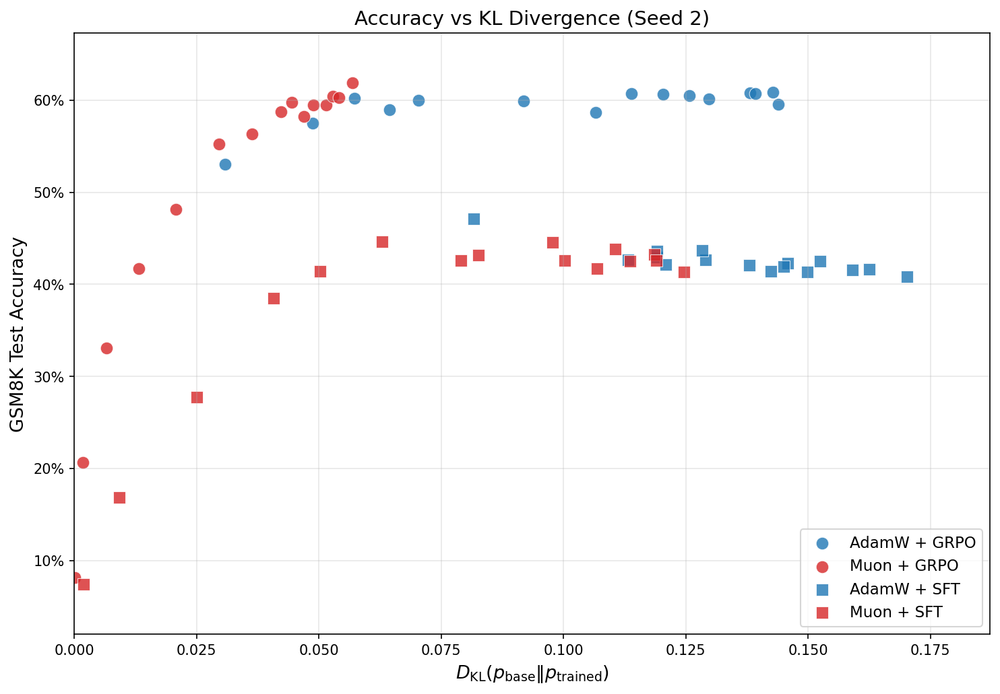
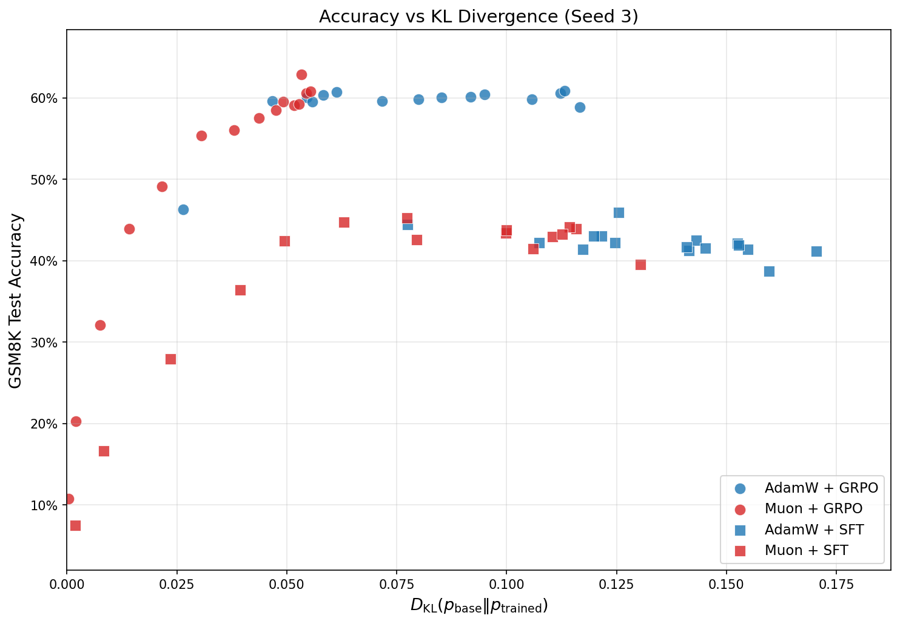

# Dense Updates in Reinforcement Learning: Investigating the Role of Update Sparsity in Policy Optimization

## Abstract

Reinforcement learning (RL) algorithms are known to produce sparse model updates during optimization, which has been hypothesized to explain their superior generalization and resistance to catastrophic forgetting compared to supervised fine-tuning (SFT). We investigate whether this sparsity is fundamental to RL's success or merely an artifact of commonly used optimizers. We compare Muon, an optimizer that produces dense, isotropic updates by constraining the spectral norm of weight updates, against AdamW in both GRPO and SFT settings. Our experiments on GSM8K demonstrate that Muon achieves comparable accuracy to AdamW while producing significantly lower reverse KL divergence from the base policy (0.14 vs 0.38 for GRPO), despite producing dense updates. These findings suggest that RL's resistance to catastrophic forgetting may not stem from update sparsity, and that dense optimizers can achieve favorable accuracy-drift tradeoffs in post-training settings.

## 1. Introduction

Muon is a recently developed optimizer that accelerates neural network convergence by enforcing constraints on the spectral norm of weight update matrices (Jordan et al., 2024). Unlike conventional optimizers, Muon produces dense, isotropic updates where the singular value spectrum of $\Delta W$ is uniformly scaled to the learning rate, encoding purely rotational information. This approach has shown promise in pretraining contexts, but its applicability to post-training settings remains underexplored.

Reinforcement learning algorithms for language model fine-tuning are characterized by sparse model updates during optimization. A prevailing hypothesis suggests that this sparsity underlies RL's superior generalization and ability to retain performance on previously learned tasks compared to SFT. An alternative explanation posits that the difference stems from policy divergence: SFT shifts the model further from the base policy, resulting in greater reverse KL divergence $D_{\text{KL}}(\pi_0 \| \pi)$, while RL makes smaller, targeted adjustments by sampling from the base policy during training.

These competing hypotheses lead to a testable prediction: if RL's generalization advantages derive from sparse updates, then Muon—which produces inherently dense updates—should exhibit degraded performance or increased catastrophic forgetting compared to AdamW in RL settings.

### 1.1 Contributions

We investigate whether RL generalizes well because it produces sparse updates, or whether dense updates can achieve comparable or superior performance. Specifically, we:

1. Compare Muon and AdamW optimizers in GRPO and SFT settings on the GSM8K benchmark
2. Measure the accuracy-KL tradeoff to quantify catastrophic forgetting
3. Analyze the spectral properties of weight updates to characterize update sparsity
4. Replicate experiments across multiple seeds to validate findings

## 2. Related Work

**Muon Optimizer.** Muon optimizes dense 2D matrices under a spectral norm constraint, limiting the principal direction of the update step to be no more than the learning rate (Jordan et al., 2024). The resulting update matrix $\Delta W$ has its singular values uniformly scaled, producing dense, isotropic updates that represent pure rotations in weight space. This helps prevent covariance shift by more effectively representing tail-end features.

**GRPO.** Group Relative Policy Optimization was proposed by DeepSeek-Math (Shao et al., 2024) as an efficient approach to policy optimization that eliminates the need for a separate critic model by using group-relative advantage estimation.

**Catastrophic Forgetting in Fine-tuning.** Recent work by Shenfeld et al. (2025) demonstrates that reverse KL divergence $D_{\text{KL}}(\pi_0 \| \pi)$ strongly correlates with catastrophic forgetting in fine-tuned language models, providing a principled metric for quantifying model drift.

## 3. Methods

### 3.1 Experimental Setup

We fine-tune `qwen2-1.5b-instruct` to produce correctly formatted and mathematically accurate responses to GSM8K questions. Models are trained to output answers within `<answer>...</answer>` tags.

**Data Format.** The model receives prompts in the following format:

```
<system>
You are a helpful math assistant. Always provide your final numerical answer inside of the <answer>...</answer> tags, e.g.: <answer>42</answer>
<user>
[Question from GSM8K]
```

**Dataset.** We use the `train` split of OpenAI's GSM8K dataset with an 80/20 train/validation split. Evaluation is performed on the official `test` split.

### 3.2 Training Details

All experiments use mixed-precision training with bfloat16 forward/backward passes and flash-attention. The effective batch size is fixed at 64 across all configurations. A constant learning rate of $\eta = 1 \times 10^{-6}$ is used without scheduling. Training budget is measured in tokens backpropagated, with initial experiments running to ~1.2M tokens and replication studies extending to 2.4M tokens.

#### 3.2.1 GRPO Configuration

We implement vanilla GRPO as proposed by DeepSeek-Math. For each iteration:
- Sample $B = 8$ batches to produce groups of $G = 8$ rollouts (total batch size: 64)
- Rollouts use temperature 0.7 with 512 max new tokens
- Inner loop: 2 epochs with batch size 64 (2 optimizer steps per rollout batch)

**Reward Structure:**
- Format reward $r_F = 0.1$ for correctly formatted `<answer>...</answer>` output
- Accuracy reward $r_A = 1.0$ for correct numerical answer
- Maximum reward: $r = r_F + r_A = 1.1$

**Loss Function.** We use GRPO without KL penalty ($\beta = 0$):

$$J(\theta) = \underset{\theta}{\arg\max} \frac{1}{N} \sum_{i=1}^{N} \frac{1}{|O_i|} \sum_{j=1}^{|O_i|} \min\left(\rho_{i,j} \cdot \hat{A}_{i}, \text{clip}(\rho_{i,j}, 1-\epsilon, 1+\epsilon) \cdot \hat{A}_{i}\right)$$

#### 3.2.2 SFT Configuration

Standard cross-entropy loss on unmasked assistant tokens.

#### 3.2.3 Optimizer Configurations

**Muon** (using `muon_fsdp2` implementation):
- Learning rate: $\eta = 1 \times 10^{-6}$
- Momentum: $\mu = 0.95$
- Weight decay: $\lambda = 0$
- AdamW RMS matching enabled
- AdamW applied to 1D/vector parameters

**AdamW:**
- $\beta_1 = 0.9$, $\beta_2 = 0.95$
- Weight decay: $\lambda = 0$

### 3.3 Evaluation Metrics

#### 3.3.1 GSM8K Accuracy vs. KL Drift

We evaluate accuracy on the GSM8K test split using inference settings (temperature 0.7, system prompt, expected formatting).

To compute reverse KL divergence, the base model generates rollouts for each test question. We then compute log-probabilities under both base and fine-tuned models and calculate $D_{\text{KL}}(\pi_0 \| \pi_{\text{exp}})$. Following Shenfeld et al. (2025), reverse KL serves as a proxy for catastrophic forgetting.

#### 3.3.2 Update Sparsity Analysis

We analyze the spectral distribution of $\Delta W = W_{\text{exp}} - W_0$ across all model parameters. Sparsity is characterized by the rank $K$ at which 90% of spectral energy is concentrated:

$$1 \leq K \leq r \quad \text{s.t.} \quad \frac{\sum_{i=1}^{K} \sigma_i^2}{\sum_{j=1}^{r} \sigma_j^2} \geq 0.9$$

where $r$ is the rank of $\Delta W$.

## 4. Results

### 4.1 Training Set Performance

On the training data, GRPO + Muon achieves comparable accuracy to GRPO + AdamW (89% vs 90%) while exhibiting approximately one-third of the KL divergence (~0.02 vs ~0.05). SFT shows similar patterns with lower overall accuracy and higher KL divergence.


*Figure 1: Training set accuracy vs. reverse KL divergence across experimental conditions.*

### 4.2 Test Set Performance

Table 1 summarizes test set results at matched training budgets (~1.1M tokens):

| Method | Optimizer | GSM8K Accuracy | Reverse KL |
|--------|-----------|----------------|------------|
| GRPO | Muon | ~60% | ~0.14 |
| GRPO | AdamW | ~60% | ~0.38 |
| SFT | Muon | ~45% | ~0.17 |
| SFT | AdamW | ~43% | ~0.33 |
| Base | - | ~6% | 0 |

GRPO + Muon achieves equivalent accuracy to GRPO + AdamW while incurring 63% less KL divergence. Similarly, SFT + Muon matches SFT + AdamW accuracy with approximately 50% less divergence.


*Figure 2: Test set accuracy vs. reverse KL divergence. Muon achieves comparable accuracy with substantially lower policy drift.*

### 4.3 Update Sparsity Analysis

We analyze the 90% spectral energy rank across all model parameters.


*Figure 3: Mean rank at which 90% of spectral energy is concentrated.*

Muon produces similar mean ranks for both SFT and GRPO configurations. Only AdamW + GRPO produces significantly lower-rank (sparser) updates than other conditions.


*Figure 4: Extended spectral analysis including magnitude and value at 90% concentration rank.*

### 4.4 Replication Studies

To validate our findings, we replicated experiments three times with different random seeds, extending the training budget to 2.4M tokens with checkpoints saved every 150K tokens.


*Figure 5: Accuracy vs. KL divergence across all checkpoints (Replication 1).*


*Figure 6: Accuracy vs. KL divergence across all checkpoints (Replication 2).*


*Figure 7: Accuracy vs. KL divergence across all checkpoints (Replication 3).*

At matched token budgets (1.1M tokens):


*Figure 8: Accuracy vs. KL at 1.1M tokens (Replication 1).*


*Figure 9: Accuracy vs. KL at 1.1M tokens (Replication 2).*


*Figure 10: Accuracy vs. KL at 1.1M tokens (Replication 3).*

## 5. Discussion

Our results challenge the hypothesis that RL's resistance to catastrophic forgetting stems from sparse updates. Despite producing dense updates (as confirmed by spectral analysis), Muon achieves:

1. **Comparable task performance**: Equivalent GSM8K accuracy to AdamW in both GRPO and SFT settings
2. **Lower policy drift**: Substantially reduced reverse KL divergence (~2.7x lower for GRPO)
3. **Consistent dense updates**: Similar spectral rank across SFT and GRPO configurations

The spectral analysis reveals that only AdamW + GRPO produces notably sparse updates. Yet Muon + GRPO achieves lower KL divergence despite dense updates, suggesting that update density is not the primary driver of catastrophic forgetting.

These findings support an alternative hypothesis: RL's advantages may stem from its optimization objective—which inherently constrains policy drift through importance sampling—rather than from properties of the update matrices themselves. The dense, isotropic updates produced by Muon appear to navigate the loss landscape more efficiently, reaching equivalent solutions with less accumulated divergence from the base policy.

## 6. Conclusion

We investigated whether reinforcement learning's resistance to catastrophic forgetting derives from sparse model updates. By comparing Muon (dense updates) against AdamW (sparse updates in RL settings) across GRPO and SFT training regimes, we demonstrate that dense optimizers can achieve favorable accuracy-drift tradeoffs. Muon + GRPO matches AdamW + GRPO accuracy while incurring significantly less reverse KL divergence, despite producing demonstrably denser updates.

These results suggest that (1) update sparsity is not necessary for RL's generalization advantages, and (2) dense optimizers like Muon may offer improved post-training efficiency by reaching target performance with less policy drift. Future work should investigate whether these findings generalize to larger models and more diverse post-training objectives.

## References

Jordan, K., Jin, Y., Boza, V., You, J., Cesista, F., Newhouse, L., & Bernstein, J. (2024). Muon: An optimizer for hidden layers in neural networks. https://kellerjordan.github.io/posts/muon/

Shao, Z., Wang, P., Zhu, Q., Xu, R., Song, J., Zhang, M., Li, Y., Wu, Y., & Guo, D. (2024). DeepSeekMath: Pushing the limits of mathematical reasoning in open language models. *arXiv preprint arXiv:2402.03300*.

Shenfeld, M., et al. (2025). Understanding catastrophic forgetting through the lens of KL divergence. *arXiv preprint arXiv:2509.04259*.
